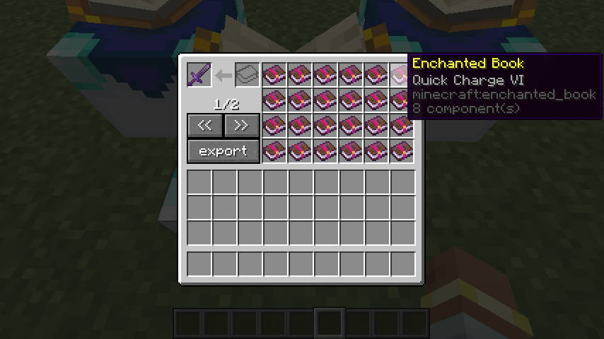
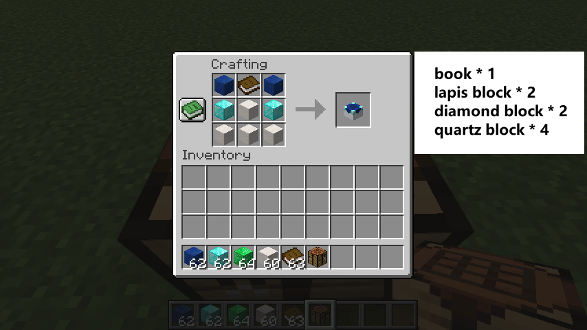
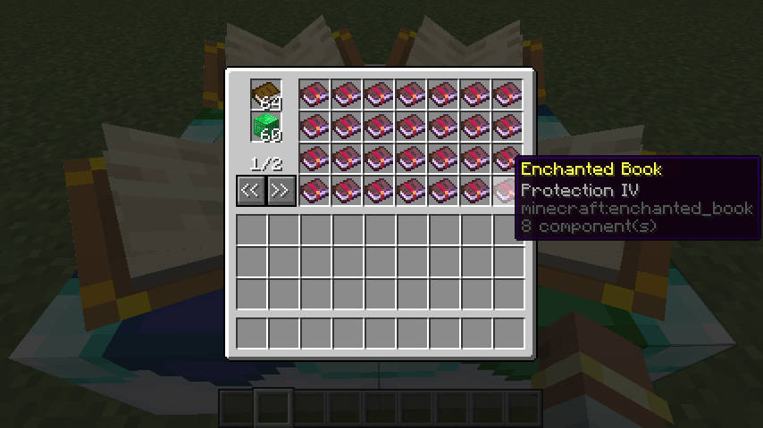
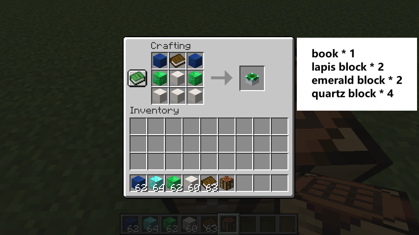

# Enchantment Custom Table

*For the Fabric version, please refer to this link: [Enchantment Custom Table For Fabric](https://github.com/HatanoKawa/EnchantmentCustomTable).
If you encounter any issues with the Fabric version, please submit them there.*

I'm not particularly interested in rolling enchantments on items, and the mod I've always used, "Disenchantment Edit Table," has been discontinued and is closed-source. So, I recreated it based on its logic to make a new mod compatible with Minecraft versions 1.21 and later. This mod allows players to freely customize the enchantments on their tools.

If you're also not a fan of randomly rolling enchantments, you might want to give this workstation a try!

# Usage

## Enchantment Custom Table

Place a tool or an enchanted book containing multiple enchantments in the top-left slot. All enchantments on the item will be displayed as individual enchanted books in the 4×6 grid on the right.

- When a player removes an enchanted book, the corresponding enchantment will be removed from the tool.

- When a player places an enchanted book into the slot, the corresponding enchantment will be added to the tool.

- Enchantments of the same type will merge their levels. For example, if you place a Diamond Sword with Sharpness I and an enchanted book with Sharpness II, the result will be a Diamond Sword with Sharpness III.

### Single Input Slot

For the single book slot to the right of the tool slot, any enchanted books placed in this slot will be immediately consumed, and their enchantments will be applied to the tool. This allows players to quickly add multiple enchantments to their tool using Shift + Left Click.

### Export Button

Clicking this button will remove all enchantments from the tool and combine them into a single enchanted book, which will be given to the player.

**Note**: If the player's inventory is full, the combined enchanted book will be dropped in front of them.

### recipe

## Enchantment Conversion Table

Place a book and either emeralds or emerald blocks in the designated slots on the left. If the minimum cost is met (by default, 1 book + 36 emeralds or 4 emerald blocks), the 4×7 grid on the right will display all available enchantments at their maximum level. You can then exchange books and emeralds for the corresponding enchanted books.

### recipe

# Balance Considerations
When creating this mod, I did not focus on balance. However, I understand that some players value gameplay challenges and balance.

If you have any suggestions regarding balance—such as adding configuration options to adjust costs or modify behavior—feel free to provide feedback at any time.