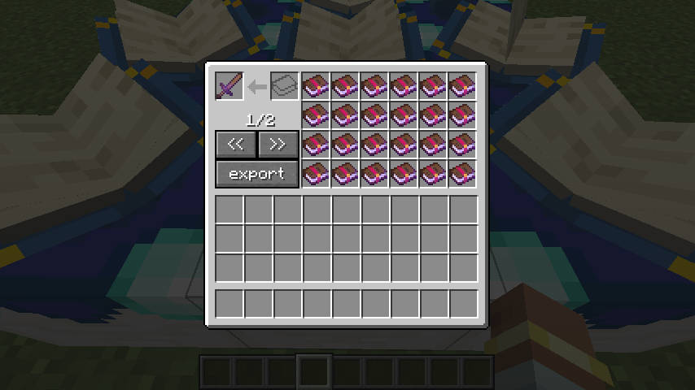
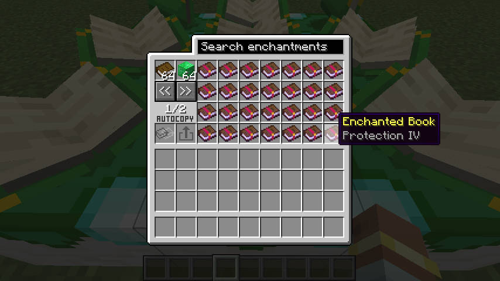
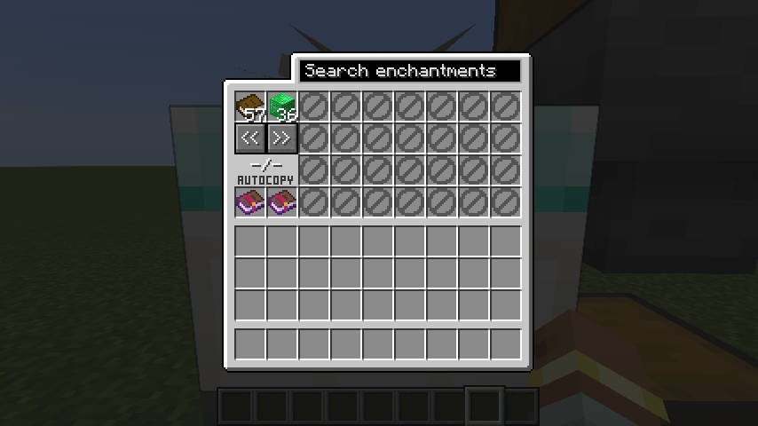
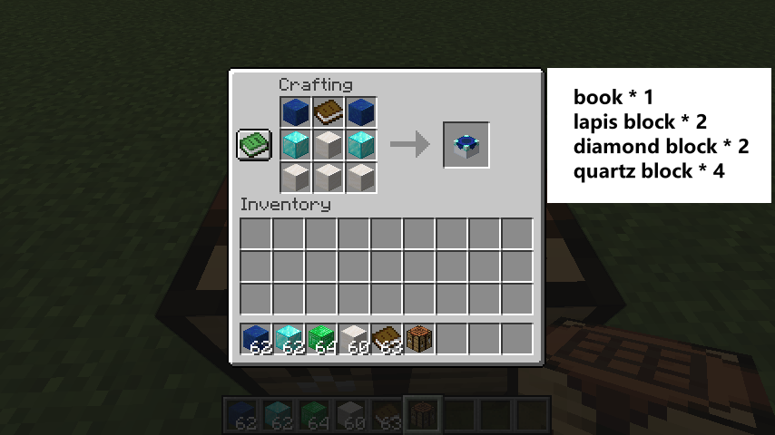
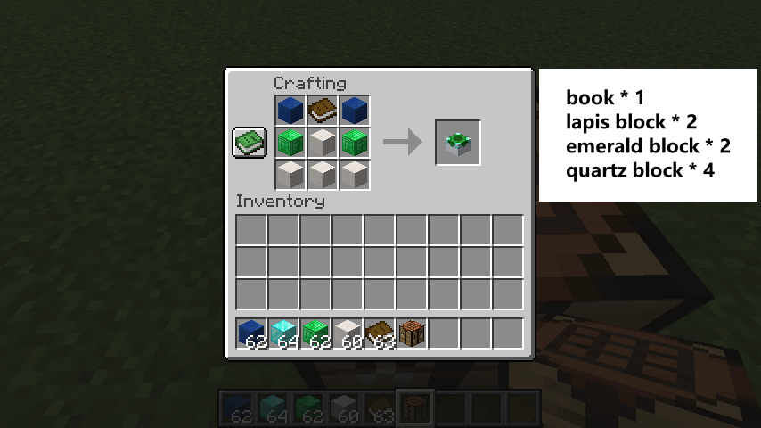

# Enchantment Custom Table（自定义附魔台）

[English README](./README.md)

还在为了凑一套理想的附魔反复刷附魔台、开图书馆、堆经验吗？这个 Mod 给你两台新工作台，让你像整理背包一样自由地摆弄附魔。

- **自定义附魔台**：直接在工具或附魔书上「改装」附魔——加一个、删一个、把高级附魔拆成低级的，或者把两本同样的附魔书合成更强的一本。
- **附魔书转换台**：拿普通书加上一点绿宝石，就能换到想要的附魔书；还能照着你给的一本附魔书「复印」出一模一样的。

> 这个 Mod 默认玩起来是比较「随心所欲」的。如果你（或者你做的整合包）希望玩起来更有挑战、更平衡，可以在配置里打开几个更严格的开关，后面会讲到。

想下载正式版，去 [CurseForge](https://www.curseforge.com/minecraft/mc-mods/enchantment-custom-table) 或 [Modrinth](https://modrinth.com/mod/enchantment-custom-table)。遇到 bug 或者有建议，欢迎到 [GitHub Issues](https://github.com/HatanoKawa/EnchantmentCustomTable/issues) 告诉我们。

## 支持的版本

NeoForge 和 Fabric 两个加载器都有对应版本，支持 Minecraft `1.21.1` 到 `1.21.11`，以及 `26.1`、`26.1.1`、`26.1.2`。

**小提示**：下载时记得对上两件事——你用的加载器（NeoForge 还是 Fabric）和你的游戏版本，两者都要和 jar 文件匹配，不然进不去游戏。

## 自定义附魔台：随意摆弄你的附魔

把一件**工具**或一本**附魔书**放进左上角的格子，工作台就会把它身上的每一个附魔，都拆成一本本附魔书摆在右边给你看。接下来你可以：

- **想删掉某个附魔？** 直接把右边那本附魔书拿走，物品上对应的附魔就没了。
- **想加一个附魔？** 把一本附魔书放进输入格，或者放进右边任意一个空格子，它就会附到物品上。
- **想强化已有的附魔？** 把附魔书叠到右边同名的那一本上，两个就会合并。
- **想把一本高级书拆开？** 把一本只有「单个附魔」的书放进左上角的格子，它会拆成几本等级更低的书让你挑。
- **想一次清空？** 点导出按钮，物品上所有附魔会被一次性取下，打包成一本附魔书还给你。

默认规则下，两个相同的附魔合并时等级是**直接相加**的。比如锋利 IV ＋ 锋利 IV ＝ 锋利 VIII。（如果你想让它别这么离谱，可以打开后面介绍的严格配置。）

## 附魔书转换台：把普通书换成附魔书

**普通兑换模式**很简单：放进普通书，再放够绿宝石或绿宝石块当「手续费」。材料够了之后，右边就会列出你能换到的附魔书。每拿走一本，就扣掉一本普通书和相应的绿宝石。

右边书太多找不着？用上面的**搜索框**按附魔名字筛一下就行。

至于换出来的附魔是几级，由配置项 `convertOnlyLevelOneBook` 决定：默认给你能给到的**最高等级**；打开这个开关后，就只给 **1 级**的。

### 复制模板模式：照着一本书「复印」

把一本附魔书放进**模板格**，转换台就切换到复制模式。这时右边的兑换列表会暂时关掉，改成：只要工作台里有一本普通书加足够的绿宝石，输出格就会出现一本和模板**一模一样**的复制品。

能用来当模板的书有几个条件：

- 必须是**附魔书**（不能是工具）。
- 上面**只能有一个**附魔，不能是好几个混在一起的。
- 附魔等级要**大于 0**。
- 附魔等级**不能超过**这个附魔本来的最高等级。

## 自动化（漏斗、管道之类）

两个工作台里放的东西都是**真实存在**的——会一直保存在那儿，方块被打掉时也会原样掉出来，不会凭空消失。

为了不让漏斗、物流 Mod 钻空子绕过游戏里的规则，自动化是被**特意限制**过的：

- **自定义附魔台**：漏斗可以往输入格塞附魔书，它会自动合并到台子里已有的物品上；但里面那件主工具/主附魔书，漏斗**拿不出来**。
- **附魔书转换台**：可以自动塞普通书和绿宝石付款，但**只能从「复制输出格」把东西抽走**。
- **模板格**只能玩家手动放，自动化既不能塞也不能换。
- 右边那些可兑换的附魔书只是给玩家「看着选」的，本质上不是真实物品，自动化碰不到。
- **想搞自动量产同一种附魔书，请用复制模板模式**，而不是去抓右边的兑换列表。

一句话记住最关键的一点：**当模板用的那本书，必须只含一个附魔，而且等级别超过它原本的上限。**

## 配置项：想玩得更平衡就改这里

- **NeoForge 玩家**：可以直接在游戏里的「Mod 配置界面」改，也可以改加载器管理的 common 配置文件。
- **Fabric 玩家**：配置文件在 Fabric 的 config 文件夹里，名字叫 `enchantment_custom_table.json`。

| 配置项 | 默认值 | 它管什么 |
| --- | --- | --- |
| `minimumEmeraldCost` | `36` | 转换台每次要花多少颗绿宝石。填 `0` 就是不用绿宝石。 |
| `minimumEmeraldBlockCost` | `4` | 转换台每次要花多少块绿宝石块。填 `0` 就是不用绿宝石块。 |
| `enforceEnchantmentLevelLimit` | `false` | 打开后，合并重复附魔时**不能超过该附魔本来的最高等级**。注意：新加一个附魔不受这条限制，所以别的 Mod 造出来的「超标」附魔书依然能用。 |
| `incrementalSameLevelMerge` | `false` | 一个更平衡的合并规则。打开后，**只有等级完全相同**的两本同名书才能合并，而且合并一次只 **+1 级**。比如锋利 V ＋ 锋利 V ＝ 锋利 VI，而不是直接变锋利 X。 |
| `convertOnlyLevelOneBook` | `false` | 打开后，转换台只产出 **1 级**附魔书，而不是最高等级。 |
| `freeConversionTableCosts` | `false` | 打开后，转换台可以免费生成和复制附魔书。书本槽和付款槽不再接受输入，但模板复制输出依然可以被自动化抽出。 |

几点需要注意：

- `enforceEnchantmentLevelLimit` 和 `incrementalSameLevelMerge` 互不影响，可以单独开。两个都开的话，同等级合并依然不会超过正常上限。
- 打开 `incrementalSameLevelMerge` 后，**拆书的方式也会跟着变**：比如一本锋利 V 会被拆成两本锋利 IV，而不是默认那种「对半分」的拆法。
- `freeConversionTableCosts` 和把绿宝石消耗填成 `0` 不一样：消耗为 `0` 是禁用对应付款物品，免费模式则会同时移除书本和付款需求。

### 已经不用的旧配置项

下面这些是老版本的配置名，现在已经**不起作用**了。如果你的旧配置文件里还有它们，建议删掉重新生成，或者手动换成新名字：

- `ignoreEnchantmentLevelLimit` → 改用 `enforceEnchantmentLevelLimit`（含义正好相反）。
- `convert_max_level_book` → 改用 `convertOnlyLevelOneBook`（含义正好相反）。
- `enableXpRequirement` → 已删除，没有替代项。

## 怎么合成这两台工作台

两个配方里标星号（\*）的格子，可以放**任意一种石英方块**，具体接受这些（属于 `enchantment_custom_table:quartz_blocks` 物品标签）：

- 石英块
- 錾制石英块
- 平滑石英块
- 石英柱
- 石英砖

### 自定义附魔台的配方

按工作台的 3×3 格子摆放：

| 左 | 中 | 右 |
| :---: | :---: | :---: |
| 青金石块 | 书 | 青金石块 |
| 钻石块 | 石英块* | 钻石块 |
| 石英块* | 石英块* | 石英块* |

\* 标星号的格子放上面列出的**任意一种石英块**都行。

### 附魔书转换台的配方

按工作台的 3×3 格子摆放：

| 左 | 中 | 右 |
| :---: | :---: | :---: |
| 青金石块 | 书 | 青金石块 |
| 绿宝石块 | 石英块* | 绿宝石块 |
| 石英块* | 石英块* | 石英块* |

\* 标星号的格子放上面列出的**任意一种石英块**都行。
