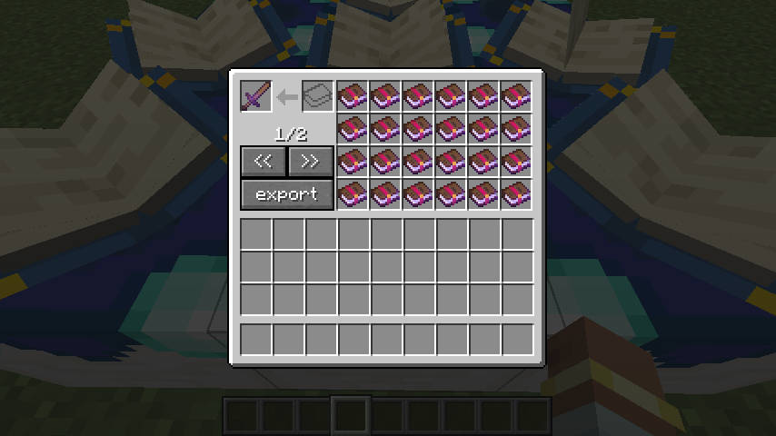
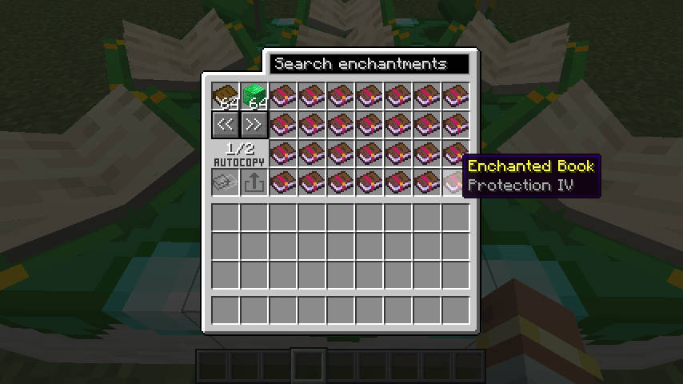
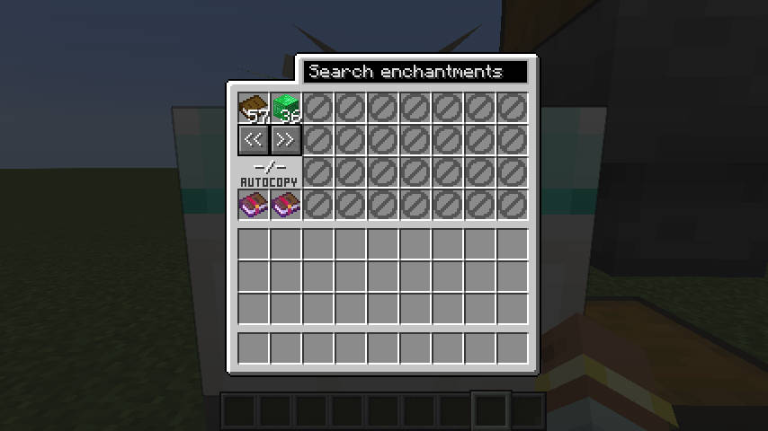
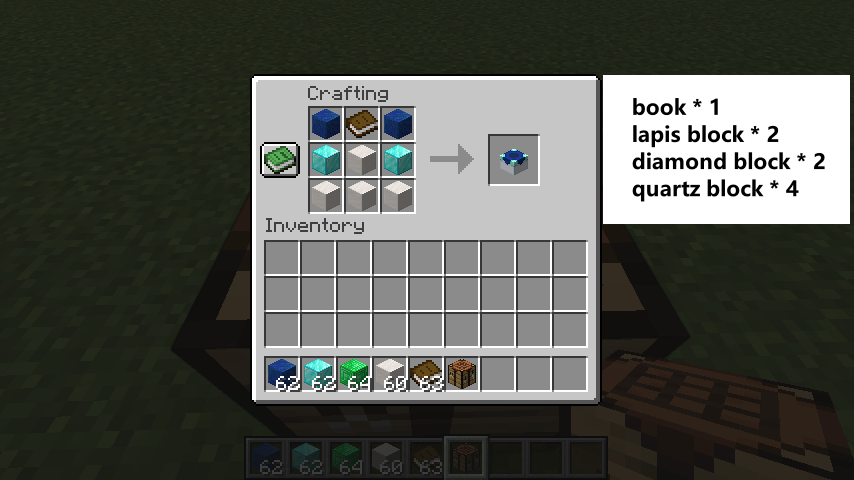
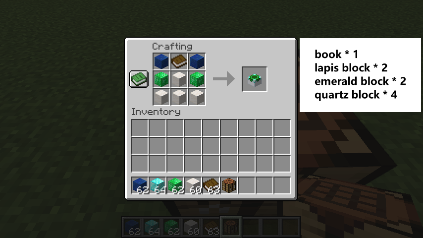

# Enchantment Custom Table（自定义附魔台）

<a href="https://www.curseforge.com/minecraft/mc-mods/enchantment-custom-table"></a>
<a href="https://www.curseforge.com/minecraft/mc-mods/enchantment-custom-table"></a>
<a href="https://modrinth.com/mod/enchantment-custom-table"></a>

[English README](./README.md)

还在为了凑一套理想的附魔反复刷附魔台、开图书馆、堆经验吗？这个 Mod 给你两台新工作台，让你像整理背包一样自由地摆弄附魔。

- **自定义附魔台**：为工具和附魔书添加、移除、拆分或合并附魔。
- **附魔书转换台**：用普通书和可配置的付款物品换取附魔书，也可以照着模板复制附魔书。

默认规则比较宽松。玩家和整合包作者可以通过下方配置调整付款物品、费用和附魔规则。

正式发布版本可从 [CurseForge](https://www.curseforge.com/minecraft/mc-mods/enchantment-custom-table) 或 [Modrinth](https://modrinth.com/mod/enchantment-custom-table) 下载。反馈问题或建议请前往 [GitHub Issues](https://github.com/HatanoKawa/EnchantmentCustomTable/issues)。

## 支持版本与安装

**当前分支（`dev`）支持 Minecraft `26.1`, `26.1.1`, `26.1.2`, `26.2`, `26.3`，加载器为 NeoForge 和 Fabric，游戏需要 Java 25。** 本文对应当前分支源码，包含 **2.1.0 起**采用的结构化付款配置；下载平台上的发布版本可能晚于分支进度，请核对所选发布包的 Minecraft 版本、加载器及更新说明。

全部活跃维护分支如下。每一行列出的 Minecraft 版本均支持该行的两种加载器；分支系列名不代表该系列的所有版本都已适配。

| 分支 | 实际支持的 Minecraft 版本 | 加载器 | 游戏 Java 版本 |
| --- | --- | --- | --- |
| [`dev`](https://github.com/HatanoKawa/EnchantmentCustomTable/tree/dev) | `26.1`, `26.1.1`, `26.1.2`, `26.2`, `26.3` | NeoForge / Fabric | 25 |
| [`maint/1.21.x`](https://github.com/HatanoKawa/EnchantmentCustomTable/tree/maint/1.21.x) | `1.21.1`, `1.21.2`, `1.21.3`, `1.21.4`, `1.21.5`, `1.21.6`, `1.21.7`, `1.21.8`, `1.21.9`, `1.21.10`, `1.21.11` | NeoForge / Fabric | 21 |
| [`maint/1.20.x`](https://github.com/HatanoKawa/EnchantmentCustomTable/tree/maint/1.20.x) | `1.20.1` | Forge / Fabric | 17 |
| [`maint/1.19.x`](https://github.com/HatanoKawa/EnchantmentCustomTable/tree/maint/1.19.x) | `1.19.2` | Forge / Fabric | 17 |
| [`maint/1.18.x`](https://github.com/HatanoKawa/EnchantmentCustomTable/tree/maint/1.18.x) | `1.18.2` | Forge / Fabric | 17 |

安装对应加载器，将匹配的 Mod jar 放入 `mods/`。Fabric 还需要安装对应 Minecraft 版本的 **Fabric API**。多人游戏需在**客户端和服务器两端安装**本 Mod，并使用一致的 Mod 版本以保证配置同步。每个实例只需放入对应加载器、对应 Minecraft 版本的一个 jar。

## 自定义附魔台：整理物品上的附魔



本文的界面截图来自较早版本，用于展示基本布局；槽位位置和付款图标可能与当前版本不同，实际费用以游戏内的付款提示为准。

将工具或附魔书放进主物品格，右侧会展示可取下的附魔；如果放入的是只有一个附魔、且等级高于 I 的书，则展示拆分选项。

- **移除**：拿走右侧对应的附魔书，物品上的该附魔随之移除。
- **添加或合并**：将附魔书放入输入格或右侧允许放入的格子，其附魔会应用到主物品上，并消耗这本输入书。
- **拆分**：从单附魔高级书的拆分选项中取走一本。默认规则会从原书扣除取出书的等级，再刷新选项；例如从锋利 V 取出锋利 II，主物品格中留下锋利 III。右侧选项是预览，并不是额外存放的书。
- **导出**：导出按钮将工具上的全部附魔汇成一本书；如果主物品本身就是附魔书，则直接将这本书交还给玩家。

默认情况下，同名附魔合并时**等级相加**：锋利 IV ＋ 锋利 IV ＝ 锋利 VIII。下方配置可以要求仅合并相同等级，或拒绝超过该附魔正常最高等级的合并。

## 附魔书转换台：兑换附魔书



**普通兑换模式**每本消耗**一本普通书，加一种付款选项**。默认三选一：**36 绿宝石、4 绿宝石块、1 下界之星**。将其中一种物品放入付款格即可，不同选项不能混合凑数。默认加入下界之星来自玩家建议。

材料足够时，右侧展示可兑换的附魔书，可以搜索和翻页查找。普通兑换默认产出该附魔的**正常最高等级**；开启 `convertOnlyLevelOneBook` 后产出 **I 级**。取走书时才扣除本次费用。

### 模板复制模式

将合格的附魔书放入**模板格**，即可从普通兑换切换到复制模式。模板必须**只含一个附魔**，且等级**大于 0、不超过该附魔的正常最高等级**。工具、多附魔书和超等级书不能作为模板。

当复制输出格为空且材料足够时，工作台消耗一本普通书及对应费用，在输出格生成一份完整复制品。**模板本身保留，不会消耗。** 复制品保留模板的等级和其他物品数据；`convertOnlyLevelOneBook` 只影响普通兑换。复制在**生成成品时扣费**，因此输出格中已经出现的书已经支付过费用。免费模式下兑换和复制均不需要材料，但模板限制仍然生效。



## 存储与自动化

两个工作台的实际库存会保存在方块中，包括未使用的材料、主物品或模板，以及已生成的复制成品。关闭界面、保存世界后仍会保留，破坏方块时会掉落。右侧附魔选项由库存推导生成，不会额外掉落预览中的书。

- **自定义附魔台**：自动化可以输入能够合并到台内现有物品上的附魔书。主物品需要玩家放入和取出，自动化不能抽走它。
- **附魔书转换台**：自动化可以输入普通书和接受的付款物品，只能抽取**复制输出格**中的成品。
- 模板格由玩家管理，自动化不能放入、替换或抽取模板。
- 普通兑换列表不能由自动化抽取；需要持续量产时请使用模板复制。
- 免费模式下，普通书格与付款格不接受新输入；原有物品仍可由玩家取回，自动化仍可抽取复制成品。

## 配置

下列路径均相对于游戏实例或独立服务器目录，首次启动会生成配置文件。

- **NeoForge：`config/enchantment_custom_table-common.toml`。** 可直接编辑文件，或经 Mod 列表打开本 Mod 的配置界面。付款编辑器支持逐行添加、删除和修改，以及保存、取消和恢复默认。
- **Fabric：`config/enchantment_custom_table.json`。** 直接编辑文件；本 Mod 暂未提供 Fabric 配置界面。

| 配置项 | 默认值 | 作用 |
| --- | --- | --- |
| `paymentOptions` | 36 绿宝石 / 4 绿宝石块 / 1 下界之星 | 兑换与复制的付款选项，每份成品消耗其中一种及一本普通书。 |
| `enforceEnchantmentLevelLimit` | `false` | **合并重复附魔**时，如果结果超过该附魔正常最高等级，就拒绝合并。添加物品原本没有的附魔不受此上限约束。 |
| `incrementalSameLevelMerge` | `false` | 重复附魔必须等级相同才能合并，结果为原等级加一，而非等级相加；同时改变单附魔书的拆分规则，见下文。 |
| `convertOnlyLevelOneBook` | `false` | 普通兑换只产出 I 级书，而非正常最高等级；模板复制仍保留模板等级。 |
| `freeConversionTableCosts` | `false` | 兑换与复制均不消耗普通书或任何付款物品，两个材料格也不再接受新输入。 |

`enforceEnchantmentLevelLimit` 和 `incrementalSameLevelMerge` 可以独立开启。只开启递增合并时，锋利 V ＋ 锋利 V ＝ 锋利 VI；若同时开启等级上限，则会拒绝该次合并。递增模式的拆分是相反过程：从单附魔锋利 V 书中取出锋利 IV 后，主物品格中留下另一本锋利 IV。

### 完整默认配置示例

`configVersion` 是 Mod 管理的格式版本，保留为 `2`，它不是难度选项。费用必须是整数，不加引号。修改已有配置时，请保留其他需要沿用的设置。

Fabric JSON：

```json
{
  "configVersion": 2,
  "paymentOptions": [
    { "item_id": "minecraft:emerald", "cost": 36 },
    { "item_id": "minecraft:emerald_block", "cost": 4 },
    { "item_id": "minecraft:nether_star", "cost": 1 }
  ],
  "enforceEnchantmentLevelLimit": false,
  "incrementalSameLevelMerge": false,
  "convertOnlyLevelOneBook": false,
  "freeConversionTableCosts": false
}
```

NeoForge common TOML：

```toml
configVersion = 2
paymentOptions = [
  { item_id = "minecraft:emerald", cost = 36 },
  { item_id = "minecraft:emerald_block", cost = 4 },
  { item_id = "minecraft:nether_star", cost = 1 }
]
enforceEnchantmentLevelLimit = false
incrementalSameLevelMerge = false
convertOnlyLevelOneBook = false
freeConversionTableCosts = false
```

### 付款列表校验规则

使用完整物品 ID，例如 `minecraft:nether_star`，也可以使用已注册的其他模组物品 ID。仅按物品 ID 匹配，不支持物品标签、NBT 或组件条件，也不返还容器。将鼠标放在付款区域的问号上，可以查看实际生效的费用。

- 普通书（`minecraft:book`）、附魔书（`minecraft:enchanted_book`）、空气、非法或未注册 ID、缺失或非整数费用会被忽略。同一 ID 保留第一条有效配置，最多接受 256 项。
- 过滤后没有可用项时，恢复上述三项默认值。空列表**不会禁用工作台，也不会变成免费兑换**。
- 实际费用为 `max(1, min(物品默认堆叠上限, 付款格上限 64, 配置费用))`。零和负数修正为 1，过大费用压到上限；例如堆叠上限为 16 的物品，最多收取 16 个。单个物品堆的自定义组件不会降低固定价格。配置文件本身仍需符合 JSON/TOML 语法。
- **删除条目才表示禁用该付款物品**，零不再表示禁用。免费兑换使用 `freeConversionTableCosts`；整合包若要禁止合成工作台，可以移除或禁用其合成配方。

### 旧配置迁移

如果没有 `paymentOptions`，旧的 `minimumEmeraldCost` 和 `minimumEmeraldBlockCost` 会自动迁移。首次迁移前，会在原文件旁保留后缀为 **`.payment-v1.bak`** 的原文件备份。

- 旧配置的正数费用转成列表项，零费用项不加入；两项均为零时，改用新的三项默认值。
- 已有自定义列表或迁移后的非空列表**不会自动增加下界之星**；需要时请自行添加。四个现行玩法开关保持原值。
- 更早的 `ignoreEnchantmentLevelLimit` 和 `convert_max_level_book` 已不再读取，也不会自动迁移。若要保留旧含义，需分别设置 `enforceEnchantmentLevelLimit` 和 `convertOnlyLevelOneBook`，并将布尔值**取反**；只改名、保留原值会导致行为相反。
- `enableXpRequirement` 已删除，没有替代项。

手动调整前请备份配置，无需为了迁移而删除整个文件。

### 服务器规则与配置生效

多人游戏统一由**服务器决定付款列表和四个玩法开关**。服务器规则在本次连接期间覆盖客户端本地设置，不写入客户端配置文件，断开连接后清除。连接远程服务器时，NeoForge 配置界面只读显示服务器规则；需要修改时，应编辑服务器上的文件。单人世界使用本地实例配置。

NeoForge 在运行中应用有效的文件修改，并同步给在线玩家；若修改后语法有误，会保留上次有效规则和待修复的文件。Fabric 修改后需**重启世界或独立服务器**。启动时若无法解析配置，请根据日志修复原文件，它不会被自动覆盖成默认配置；有效服务器规则就绪前，兑换不会执行。

## 怎么合成这两台工作台

两个配方里标星号（\*）的格子，可以放**任意一种石英方块**，具体接受这些（属于 `enchantment_custom_table:quartz_blocks` 物品标签）：

- 石英块
- 錾制石英块
- 平滑石英块
- 石英柱
- 石英砖

### 自定义附魔台的配方



按工作台的 3×3 格子摆放：

| 左 | 中 | 右 |
| :---: | :---: | :---: |
| 青金石块 | 书 | 青金石块 |
| 钻石块 | 石英块* | 钻石块 |
| 石英块* | 石英块* | 石英块* |

\* 标星号的格子放上面列出的**任意一种石英块**都行。

### 附魔书转换台的配方



按工作台的 3×3 格子摆放：

| 左 | 中 | 右 |
| :---: | :---: | :---: |
| 青金石块 | 书 | 青金石块 |
| 绿宝石块 | 石英块* | 绿宝石块 |
| 石英块* | 石英块* | 石英块* |

\* 标星号的格子放上面列出的**任意一种石英块**都行。

## 编译当前分支

使用 JDK 25，在当前 checkout 根目录运行：

```sh
./gradlew :common:test
./gradlew :26.3:build :fabric_26_3:build
./gradlew :verifyAll
./gradlew :buildReleaseArtifacts
```

第二条命令编译一个已支持版本的双加载器构建；`verifyAll` 验证当前分支的完整矩阵，`buildReleaseArtifacts` 编译并收集当前分支的可发布 jar 到 `build/release-artifacts/`。其他维护系列需要在各自分支编译。更多构建说明见 [AGENTS.md](./AGENTS.md)，游戏内验证见 [GUI 测试说明](./tools/gui-validation/README.md)。
